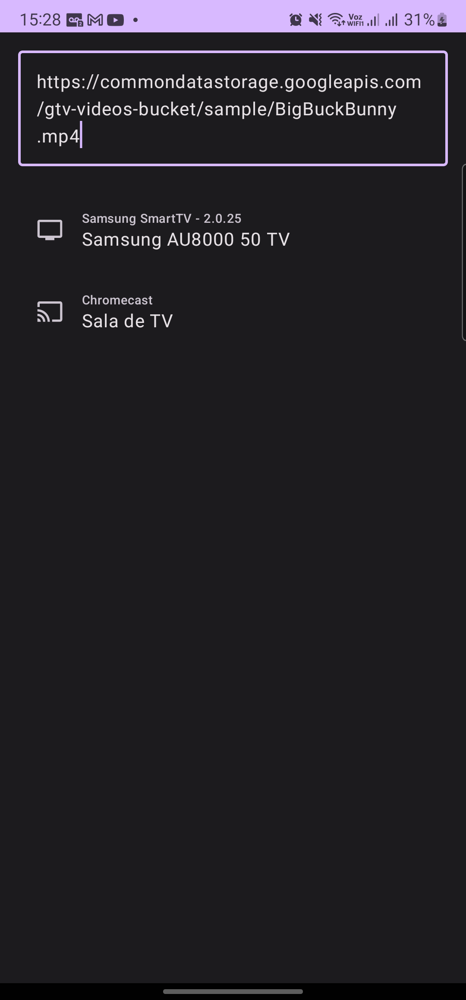

# AndroidCast

AndroidCast is an Android app built using Kotlin and Jetpack Compose that allows you to easily cast online videos to your cast device.

 

## Support

The following devices and platforms are currently supported:

- Samsung TVs (Smart View SDK)
- Chromecast (coming soon)

## Contributing

Contributions are welcome! If you find a bug or have a feature request, please [open an issue](https://github.com/Gidex/AndroidCast/issues/new).

If you would like to contribute code, please follow these steps:

1. Fork the repository
2. Create a new branch for your feature or bug fix: `git checkout -b my-feature`
3. Make your changes and commit them: `git commit -am 'Add new feature'`
4. Push your changes to your fork: `git push origin my-feature`
5. Create a new pull request

## License

This project is licensed under the MIT License - see the [LICENSE](LICENSE) file for details.
